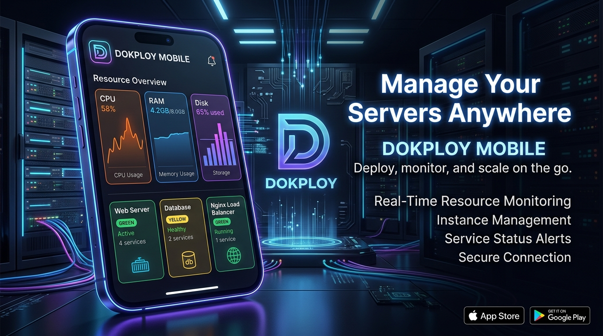

# 📱 Dokploy Companion

<p align="center">
  
</p>

<p align="center">
  
  
  
  
  
</p>

An elegant, premium self-hosted mobile companion dashboard designed to monitor and manage your **Dokploy VPS** directly from your phone, physics-based gesture control and beautiful dark aesthetics.

> [!NOTE]
> **Dokploy Companion** is an **unofficial community project** currently in **Beta** (Release `0.1.0-beta.1` / App version `0.1.0`). It is not officially affiliated with or endorsed by the core Dokploy project.

---

## ✨ Implemented Features

* **🛡️ Connection & Security**:
  * On-device biometric locks (Fingerprint / Face ID) protecting connection data.
  * Credentials securely stored using platform-specific hardware-backed container APIs (`SecureStore`).
  * In-transit traffic redaction module preventing API credentials from leaking in logs or error feeds.
* **📊 VPS Resource Gauges**:
  * CPU, RAM, and Disk space telemetry dials updated in real-time.
* **⚙️ Server Diagnostics & Maintenance**:
  * View active server properties and diagnostics.
  * One-tap Docker host cleanup tools (purge unused containers, images, volumes, and build caches).
* **🗂 Project & Namespace Explorer**:
  * Browse project namespaces mapping Applications, Compose stacks, and Databases in a unified interface.
  * View container ports, mount locations, networking configurations, status indicators, and system uptime.
  * Real-time global build stream logging deployment stages.
* **🎛 Full Lifecycle Controls**:
  * Start, Stop, Restart, and Redeploy actions for Applications, Compose configurations, and Databases.
  * Safety prompts for Compose redeployments to prevent accidental disruptions.
* **🌐 Domain & HTTPS Manager**:
  * Dedicated panel to inspect domains, certificates, and Let's Encrypt status.
  * Create, edit, validate, delete, and copy routes with support for generated test domains.
* **💾 Comprehensive Backup Dashboard**:
  * **Database Backups**: Monitor backup schedules, list recent dump archives, edit configurations, and trigger manual database backups.
  * **Volume Backups**: Setup named-volume backup plans for application and docker-compose containers, with directory bind-mount protections.
* **🧪 Developer Hardening**:
  * More than 150 focused Jest tests verifying capability checks, network fallbacks, database schedules, and volume queries.

---

## 🚀 How to Run and Test

### 1. Build and Test Locally
Ensure you have Node.js (v20 or v22) installed.

1. **Install Dependencies**:
   ```bash
   npm ci
   ```
2. **Type Checking**:
   ```bash
   npm run typecheck
   ```
3. **Execute Test Suite**:
   ```bash
   npm run test:ci
   ```
4. **Run Development Server**:
   ```bash
   npm run start
   ```
   To run in the Expo Go client or simulator runtime, execute `npm run android` or `npm run ios`. Note that this triggers the development runtime and does not build a native app.
5. **Local Android Native Run**:
   To compile and run the native debug project on an emulator or connected device:
   ```bash
   npm run android:run
   ```

### 2. Manual Android Preview APK Build (GitHub Actions)
You can compile installable `.apk` binaries directly via GitHub Actions:
1. Push the repository to your own GitHub account.
2. Navigate to the **Actions** tab of your repository.
3. Select the **Build Android APK** workflow in the left navigation sidebar.
4. Click the **Run workflow** button to trigger the manual builder.
5. Once compilation completes (~10 minutes), scroll down to the **Artifacts** section at the bottom of the page.
6. Download the **`Android Preview APK`** (or `Android Debug APK`) artifact, extract the zip file, and install the `.apk` on your test device.

---

## ⚙️ Connection Setup

When launching the app for the first time, you will configure your endpoint:
1. **VPS Address**: The HTTP/HTTPS address of your Dokploy control panel (e.g., `https://dokploy.yourdomain.com`).
   * *Note: Public servers must use HTTPS. Plain HTTP is only permitted on trusted private networks (e.g. `localhost`, `192.168.x.x`) after accepting a security warning.*
2. **API Key**: Generated on your Dokploy panel under **Settings** > **Profile** > **API/CLI**.

The app runs a quick connection verification request to ensure the URL resolves and credentials are valid before storing them and taking you to the dashboard.
